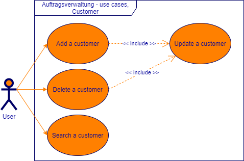
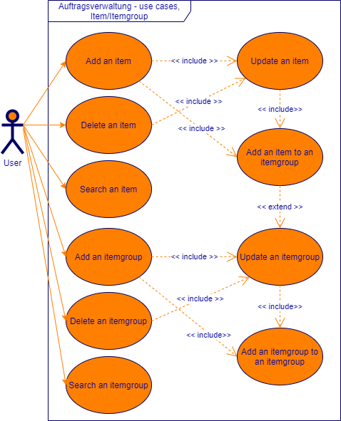
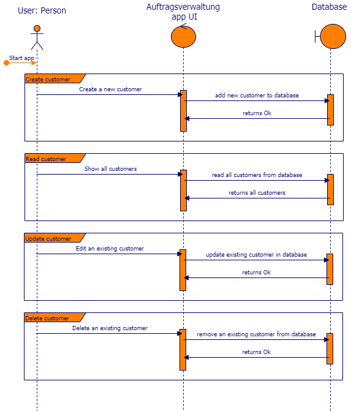
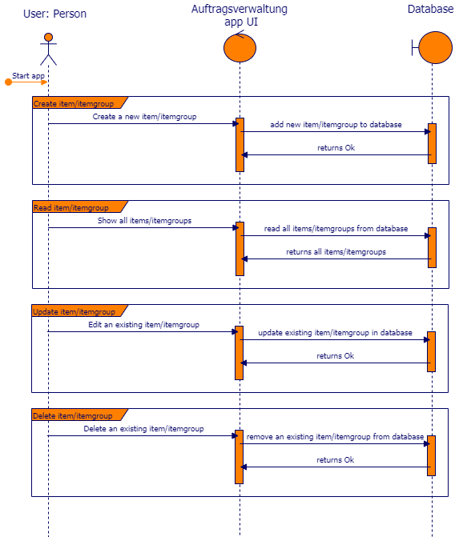

# 01. Introduction and Goals
Ziel dieses Projekts ist es, das in den letzten drei Jahren gelernte anzuwenden. Hauptsächlich wird der Inhalt der Module Programming Advanced I + II und Datenbanken Advanced bearbeitet. Das gesamte Projekt wurde parallel, während dem letzten Semester umgesetzt.

## Requirements Overview

### Use-Cases
Eine Übersicht aller Use-Cases für das Projekt 'OrderManager':

**Kunden**

| Nr | Role | Use-Case |
| - | - | - |
| K01 | Sachbearbeiter | Als Sachbearbeiter möchte ich Kunden mit Name, Strasse, PLZ, Ort, Mailadresse, Website und Passwort erfassen können, um eine saubere Verwaltung zu ermöglichen. |
| K02 | Sachbearbeiter | Als Sachbearbeiter möchte ich die erfassten Kunden bearbeiten können, um Fehler zu korrigieren. |
| K03 | Sachbearbeiter | Als Sachbearbeiter möchte ich die erfassten Kunden löschen können, um einen sauberen Datenbestand zu haben. |
| K04 | Sachbearbeiter | Als Sachbearbeiter möchte ich nach Kunden suchen können, um das Finden eines Kunden zu vereinfachen. |

**Artikel und Artikelgruppen**

| Nr | Role | Use Case |
| - | - | - |
| A05 | Sachbearbeiter | Als Sachbearbeiter möchte ich Artikel mit Bezeichnung, Preis und Artikelgruppe erfassen können, um eine saubere Verwaltung zu ermöglichen. |
| A06 | Sachbearbeiter | Als Sachbearbeiter möchte ich erfasste Artikel bearbeiten können, um Fehler zu korrigieren. |
| A07 | Sachbearbeiter | Als Sachbearbeiter möchte ich erfasste Artikel löschen können, um einen sauberen Datenbestand zu haben. |
| A08 | Sachbearbeiter | Als Sachbearbeiter möchte ich nach Artikeln suchen können, um das Finden eines Artikels zu vereinfachen. |
| A09 | Sachbearbeiter | Als Sachbearbeiter möchte ich Artikelgruppen mit Bezeichnung erfassen können, um die Verwaltung von Artikeln zu vereinfachen. |
| A10 | Sachbearbeiter | Als Sachbearbeiter möchte ich eine Hierarchie der Artikelgruppen erstellen können, um Artikelgruppen zu gruppieren. |
| A11 | Sachbearbeiter | Als Sachbearbeiter möchte ich Artikel den Artikelgruppen zuweisen können, um die Artikel zu gruppieren. |
| A12 | Sachbearbeiter | Als Sachbearbeiter möchte ich erfasste Artikelgruppen bearbeiten können, um Fehler zu korrigieren. |
| A13 | Sachbearbeiter | Als Sachbearbeiter möchte ich erfasste Artikelgruppen löschen können, um einen sauberen Datenbestand zu haben. |
| A14 | Sachbearbeiter | Als Sachbearbeiter möchte ich nach Artikelgruppen suchen können, um das Finden einer Artikelgruppen zu vereinfachen. |

**Aufträge und Positionen**

| Nr | Role | Use Case |
| - | - | - |
| P15 | Sachbearbeiter | Als Sachbearbeiter möchte ich Aufträge mit Datum und Kunde erfassen können, um einen Auftrag einfach zu identifizieren. |
| P16 | Sachbearbeiter | Als Sachbearbeiter möchte ich Positionen mit Nummern, Artikel und einer Anzahl erfassen können, um eine gegliederte Übersicht zum Auftrag zu erhalten. |
| P17 | Sachbearbeiter | Als Sachbearbeiter möchte ich erfasste Aufträge bearbeiten können, um Fehler zu korrigieren. |
| P18 | Sachbearbeiter | Als Sachbearbeiter möchte ich erfasste Positionen bearbeiten können, um Fehler zu korrigieren. |
| P19 | Sachbearbeiter | Als Sachbearbeiter möchte ich erfasste Aufträge archivieren können, um einen sauberen Datenbestand zu haben. |
| P20 | Sachbearbeiter | Als Sachbearbeiter möchte ich erfasste Positionen löschen können, um Fehler zu korrigieren. |
| P21 | Sachbearbeiter | Als Sachbearbeiter möchte ich nach Aufträgen suchen können, um das Finden eines Auftrages zu vereinfachen. |

**Berichte**

| Nr | Role | Use Case |
| - | - | - |
| B22 | Sachbearbeiter | Als Sachbearbeiter möchte ich einen Bericht erhalten, welcher die Anzahl Aufträge des letzten Quartals aufzeigt, um dies bei Terminen/Besprechungen vorlegen zu können, dies soll für die vergangenen drei Jahre möglich sein. |
| B23 | Sachbearbeiter | Als Sachbearbeiter möchte ich einen Bericht erhalten, welcher die Anzahl verwaltete Artikel des letzten Quartals aufzeigt, um dies bei Terminen/Besprechungen vorlegen zu können, dies soll für die vergangenen drei Jahre möglich sein. |
| B24 | Sachbearbeiter | Als Sachbearbeiter möchte ich einen Bericht erhalten, welcher die Durchschnittliche Anzahl Artikel pro Auftrag des letzten Quartals aufzeigt, um dies bei Terminen/Besprechungen vorlegen zu können, dies soll für die vergangenen drei Jahre möglich sein. |
| B25 | Sachbearbeiter | Als Sachbearbeiter möchte ich einen Bericht erhalten, welcher den Umsatz pro Kunde des letzten Quartals aufzeigt, um dies bei Terminen/Besprechungen vorlegen zu können, dies soll für die vergangenen drei Jahre möglich sein. |
| B26 | Sachbearbeiter | Als Sachbearbeiter möchte ich einen Bericht erhalten, welcher den Gesamtumsatz des letzten Quartals aufzeigt, um dies bei Terminen/Besprechungen vorlegen zu können, dies soll für die vergangenen drei Jahre möglich sein. |

**Export**

| Nr | Role | Use Case |
| - | - | - |
| E27 | Sachbearbeiter | Als Sachbearbeiter möchte ich die Kundendaten importieren können, um bereits erfasste Daten aus anderen Systemen zu übernehmen. |
| E28 | Sachbearbeiter | Als Sachbearbeiter möchte ich die Kundendaten exportieren können, um im System erfasste Daten austauschen zu können. |

### Sequence Diagrams
Sequenzdiagramm zu den Anforderungen für die Kundenverwaltung.

Sequenzdiagramm zu den Anforderungen für die Artikel- und Artikelgruppenverwaltung.

Sequenzdiagramm zu den Anforderungen für die Auftrags- und Positionsverwaltung.

Sequenzdiagramm zu den Anforderungen für die Berichtsverwaltung und den Import/Export.

## Quality Goals
Das Projektteam hat die folgenden Qualitätsziele für das Projekt 

1. Die Anwendung soll auf einer zeitgemässen Architektur basieren. 
2. Die Anwendung soll einfach erweiterbar und anpassbar sein.
3. Die Business Logik soll eine Testabdeckung von min. 50% haben.

## Stakeholders
Die folgenden Stakeholder wurden zu dieser Anwendung identifiziert.

| Name   |  Funktion |
| - | - |
| ZbW Zentrum für berufliche Weiterbildung | Auftraggeber, Empfänger des Endprodukts |

