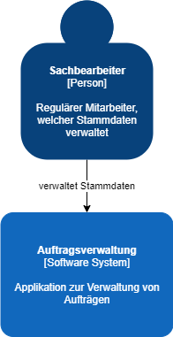
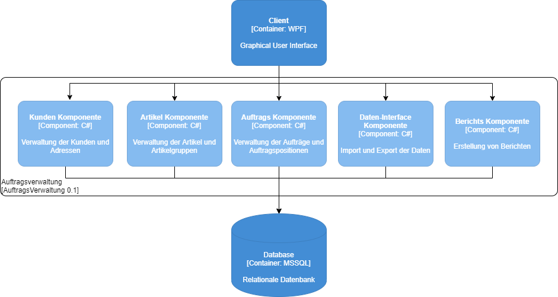

# System Scope and Context
Das System und den Kontext des Projekts wurden nach dem C4-Model erstellt.

## Context
Der Kontext wurde mit einem Diagramm dargestellt. Das Projekt besteht aus einem Sachbearbeiter, welcher die Stammdaten verwalten möchte, und der Applikation selbst. 

## Container
Das Container Diagramm gibt einen besseren Einblick, mit welchen Elementen die Applikation aufgebaut wird. Ebenfalls ist ersichtlich, welche Container miteinander kommunizieren.

## Component
Das Komponenten Diagramm gibt einen genaueren Einblick, welche Komponeneten die Business Logik beinhaltet.

